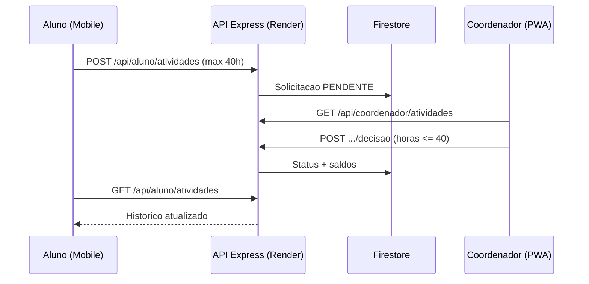

# Complementa+ — Checklist de Avaliacao (P.I.)

Resumo de como o projeto atende aos criterios finais de avaliacao, com referencia aos artefatos do repositorio **Node.js + React**.

**Frontend (PWA):** https://complementasenac.vercel.app  
**API (Render):** https://complementasenac.onrender.com  
**Mobile:** `disk3/mobile/complementasenac-mobile/complementa-app` (Expo Go — somente aluno)

---

## 1. Engenharia de Software e Ciclo de Vida

| Criterio | Como aparece no projeto |
|----------|-------------------------|
| Engenharia de software | Camadas separadas: React (PWA), Express (API), Firestore (persistencia), Expo (mobile). |
| Ciclo de vida | Evolucao Java → **Node.js/Express** na branch atual; mobile integrado a mesma API. |
| Analise de sistemas | Fluxo: aluno submete (PWA ou mobile) → coordenador valida (PWA) → saldo atualizado no Firestore. |

---

## 2. Arquitetura do Sistema

| Criterio | Como aparece no projeto |
|----------|-------------------------|
| Organizacao geral | Monorepo `site/complementasenac` com `frontend/` + `backend/`; app mobile em repositorio/pasta separada. |
| Separacao frontend/backend | PWA consome REST; backend nao serve UI (exceto health/config publicos). |
| Mobile ↔ API ↔ PWA | Mobile → `POST /api/aluno/atividades` · PWA coordenador → `POST /api/coordenador/atividades/:id/decisao`. |
| Estrutura de modulos | Backend: `routes/` → `services/` → `firestoreService`. Frontend: `pages/` → `services/api.js`. |
| Organizacao em camadas | Middleware (`authFirebase`, `roleGuard`), services de dominio, libs Firebase. |

**Stack atual (branch Node):**

| Camada | Tecnologia |
|--------|------------|
| Frontend | React + Vite (PWA) |
| Backend | **Node.js + Express** |
| Auth | Firebase Auth (Bearer token) |
| Dados | Cloud Firestore + Firebase Storage |
| Mobile | React Native + Expo Go |

---

## 3. Integracao e Comunicacao entre Sistemas

| Criterio | Como aparece no projeto |
|----------|-------------------------|
| Consumo correto de API | `frontend/src/services/api.js` e `mobile/.../src/services/api.ts` com `Authorization: Bearer`. |
| Comunicacao mobile ↔ backend | API base: `https://complementasenac.onrender.com` |
| Troca de dados via JSON | Submissoes, resumo, perfil e decisoes em JSON; comprovante em base64. |
| Persistencia | Firestore (`solicitacoes`, usuarios, saldos) via `firestoreService.js`. |

---

## 4. Interface e Experiencia do Usuario

| Criterio | Como aparece no projeto |
|----------|-------------------------|
| Organizacao visual | PWA com paineis por perfil (aluno, coordenador, admin). |
| Navegacao | React Router + Sidebar (web); React Navigation + tab bar (mobile). |
| Usabilidade | Validacao de horas no formulario; mensagens de erro da API. |
| Responsividade | PWA responsiva; mobile nativo via Expo. |
| Experiencia de app real | PWA instalavel (service worker) + app Expo para aluno. |

**Design mobile alinhado ao site:** `mobile/.../src/constants/theme.ts` (`#3d7cff`, `#14325c`, `#f7f4ef`).

---

## 5. Modelagem e Organizacao do Sistema

| Criterio | Como aparece no projeto |
|----------|-------------------------|
| Estrutura logica | Usuario, Solicitacao, Curso, Saldos (Ensino/Pesquisa/Extensao). |
| Modularizacao | `alunoService.js`, `coordenadorService.js`, `admin*Service.js`. |
| Componentizacao | Componentes React reutilizaveis (Sidebar, modais, cards). |
| Organizacao de pastas | Ver README do repositorio. |
| Separacao de responsabilidades | Routes finas; regra de negocio nos services. |

---

## 6. Reuso e Componentizacao

| Criterio | Como aparece no projeto |
|----------|-------------------------|
| Reaproveitamento | `apiRequest` (web e mobile); `validarHorasAtividade` (web e mobile). |
| Funcoes reutilizaveis | `hoursLimits.js` / `hoursLimits.ts`; formatters no mobile. |
| Componentes compartilhados | Header (mobile), Sidebar (web), modais de submissao/decisao. |

---

## 7. Refatoracao e Qualidade do Codigo

| Criterio | Como aparece no projeto |
|----------|-------------------------|
| Clareza | Services com metodos nomeados por caso de uso (`submeterAtividade`, `decidir`). |
| Reducao de duplicacao | Limite de 40h centralizado no backend Node. |
| Facilidade de manutencao | Config via variavel de ambiente `MAX_HORAS_POR_ATIVIDADE`. |

---

## 8. Gestao de Configuracao e Versionamento

| Criterio | Como aparece no projeto |
|----------|-------------------------|
| GitHub | Repositorios versionados com branches (`dev-fa`, `dev-fab`). |
| Organizacao | `.env.example` em backend e frontend; mobile com `.env.example`. |
| Controle de versoes | CORS e credenciais Firebase via env no Render/Vercel. |

---

## 9. Padroes de Projeto e Boas Praticas

| Criterio | Como aparece no projeto |
|----------|-------------------------|
| Separacao de responsabilidades | Middleware de auth + guard de role por rota. |
| Boas praticas | Validacao no servidor (nao confiar so no cliente); erros via `errorHandler.js`. |
| Singleton de servicos | `getServices.js` instancia services uma vez por processo. |

---

## 10. Documentacao e Apresentacao

| Criterio | Como aparece no projeto |
|----------|-------------------------|
| Demonstracao funcional | Aluno envia pelo mobile → coordenador aprova no PWA → historico atualiza. |
| Documentacao | `README.md` do site + este checklist. |

---

## Correcao principal: limite de 40 horas por atividade

**Regra:** maximo **40h** por submissao (aluno) e por aprovacao (coordenador).

### Onde alterar o limite no futuro

| Prioridade | Arquivo | O que mudar |
|------------|---------|-------------|
| **1 — Principal** | `backend/.env` (e Render) | `MAX_HORAS_POR_ATIVIDADE=40` |
| 2 | `backend/src/config/hoursLimit.js` | Fallback padrao (quando env ausente) |
| 3 | `backend/src/services/alunoService.js` | `validarSubmissao()` |
| 4 | `backend/src/services/coordenadorService.js` | `validarHorasAprovacao()` |
| 5 | `GET /api/config/limites` | Retorna valor atual (publico) |
| 6 | `frontend/src/constants/hoursLimits.js` | `MAX_HORAS_POR_ATIVIDADE = 40` |
| 7 | `mobile/.../src/constants/hoursLimits.ts` | `MAX_HORAS_POR_ATIVIDADE = 40` |

**Altere primeiro o `.env` / Render e depois sincronize frontend e mobile.**

---

## Integracao mobile (Expo Go)

| Item | Detalhe |
|------|---------|
| API | `https://complementasenac.onrender.com` |
| Auth | Firebase → `GET /api/auth/me` |
| Perfil mobile | Somente **ALUNO** |
| Submissao | `CargaComplementarScreen` → `POST /api/aluno/atividades` |
| Execucao | `cd complementa-app && npm install && npx expo start` |

Coordenador e admin **nao** usam o mobile — apenas o PWA no computador.

---

## Fluxo demonstravel



---

## Como rodar localmente (Node)

```powershell
# Backend
cd disk3/site/complementasenac/backend
copy .env.example .env
npm install
npm run dev

# Frontend (outro terminal)
cd disk3/site/complementasenac/frontend
copy .env.example .env
npm install
npm run dev
```

---

## Limitacoes conhecidas

- Limite de 40h e configuravel/ficticio; carga total do curso vem do vinculo (`ch_total_exigida`).
- Comprovantes grandes podem falhar (limite ~800 KB no PWA para base64).
- API Render pode ter cold start no plano gratuito.

---

## Deploy

| Componente | Plataforma |
|------------|------------|
| Frontend PWA | Vercel |
| Backend Node | Render (`complementasenac.onrender.com`) |
| Firebase | Auth + Firestore + Storage |

Apos alterar `MAX_HORAS_POR_ATIVIDADE`, redeploy do backend no Render.
